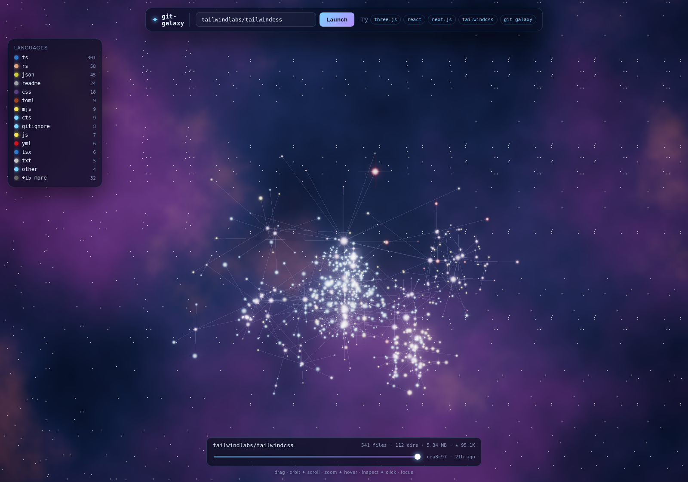

# git-galaxy

> Fly through any GitHub repository as a living 3D galaxy.

Files are stars. Directories are constellations. Commits ripple as supernovae across a timeline you can scrub. It all runs in the browser, in WebGL, with no backend.

**Live demo:** _add your deploy URL here_



---

## Why

Most repo visualizations look like file trees with a coat of paint. `git-galaxy` ignores the file-explorer metaphor entirely and asks a different question: **what does a codebase _feel_ like, from the inside?**

Open your own repo and you'll see the answer:

- The shape of every directory becomes a tilted constellation, recursively nesting like a real galactic structure.
- Each file is a star whose **color is its language** and whose **brightness grows with size**.
- Subtle filaments connect parents to children, so a single glance reveals which directories are bursting with content and which are quiet.
- Recent commits arc across the bottom of the screen — scrub the timeline and watch supernovae flare across the galaxy.

It's the kind of thing you load up just to look at, and then accidentally lose ten minutes flying around your own codebase.

## Try it out

```bash
git clone https://github.com/vgatare/git-galaxy.git
cd git-galaxy
npm install
npm run dev
```

Open `http://localhost:5173` and type any `owner/repo` into the launchpad. Or pass it via the URL: `http://localhost:5173/?repo=vercel/next.js`.

## Controls

| input             | action                                                       |
| ----------------- | ------------------------------------------------------------ |
| `drag`            | orbit the galaxy                                             |
| `scroll`          | zoom                                                         |
| `right-drag`      | pan                                                          |
| `hover`           | highlight nearest star                                       |
| `click`           | **warp** to star + open info panel (with link to GitHub blob) |
| `R`               | reset to galaxy-wide view                                    |
| `Esc`             | clear selection                                              |
| `Cmd/Ctrl + K`    | jump to repo launchpad                                       |
| `♪` button        | toggle ambient sonification                                   |
| timeline scrubber | replay commits — each commit detonates as a colored supernova |

## How it works

```
GitHub REST API
       │
       ▼
  Repo tree + languages + commits
       │
       ▼
  Recursive Fibonacci-sphere layout
       │
       ▼
  GPU points cloud (custom GLSL shaders)
       │
       ▼
  EffectComposer ─► UnrealBloomPass ─► LensingPass ─► WarpPass ─► OutputPass
```

### Layout

Every parent directory becomes a "shell" — its children are distributed on a Fibonacci sphere around it, tilted by a hash of the directory's path so each constellation feels distinct. Shells shrink with depth, so the recursive structure remains readable even for huge trees. See [`src/galaxy/layout.ts`](src/galaxy/layout.ts).

### Rendering

Stars are a single `THREE.Points` with custom GLSL — soft cores, gaussian halos, faint diffraction spikes, per-star twinkle, and a highlight ring for hover/select. With additive blending and a tuned `UnrealBloomPass`, you get that "lens-flare-y" cosmic look without any sprite textures. See [`src/render/stars.ts`](src/render/stars.ts) and [`src/render/shaders/`](src/render/shaders/).

The background is a procedural nebula shader — two layers of FBM noise modulated by a deep-space gradient and sparkled with hash-based background stars. See [`src/render/shaders/nebula.frag.glsl`](src/render/shaders/nebula.frag.glsl).

### Black Holes & Gravitational Lensing

The largest directories become black holes — complete with accretion disks (procedural GLSL with Doppler shifting, turbulence, and temperature gradients) and real-time gravitational lensing via a post-processing shader. The lensing distorts the rendered frame around each black hole's screen-space position using a simplified Schwarzschild metric, with photon sphere glow and Einstein ring effects. See [`src/render/blackhole.ts`](src/render/blackhole.ts) and [`src/render/shaders/lensing.frag.glsl`](src/render/shaders/lensing.frag.glsl).

### Warp Drive

Clicking a star triggers a hyperspace-style warp effect — radial motion blur, procedural star streaks at multiple angular frequencies, and chromatic aberration, all in a single post-processing pass. The intensity follows a bell curve: ramp up, hold, ramp down. See [`src/render/warp.ts`](src/render/warp.ts) and [`src/render/shaders/warp.frag.glsl`](src/render/shaders/warp.frag.glsl).

### Ambient Sonification

Toggle the `♪` button and the galaxy plays music. A warm C2 pad drone provides the base layer. Pentatonic tones modulate in volume based on camera proximity to clusters of each language type — fly near the TypeScript cluster and you hear different harmonics than near the Python region. Clicking a star plays a bell tone, warping plays a filter-swept whoosh, and supernovae trigger low booms with metallic shimmers. All synthesis is procedural via the Web Audio API — no audio files, no external dependencies. See [`src/audio/sonification.ts`](src/audio/sonification.ts).

### Comet Trails

Eight comets perpetually traverse the galaxy along quadratic Bézier curves between random stars, each with a 40-particle fading trail. When a comet reaches its target, it picks a new destination and continues. The effect makes the galaxy feel alive even when idle. See [`src/render/comets.ts`](src/render/comets.ts).

### Picking

`Raycaster` against a custom `Points` shader gets you nowhere — point sizes aren't reflected in the raycaster's hit-testing. So `git-galaxy` projects every star to screen space once per frame and does a pixel-radius nearest-neighbour search. See [`src/interaction/picking.ts`](src/interaction/picking.ts).

## Tech

- [Three.js r169](https://threejs.org/) — WebGL rendering, post-processing, controls
- TypeScript, strict mode
- [Vite](https://vitejs.dev/) for the dev server and build
- No backend — the entire app is static, talking directly to the GitHub REST API from the browser

The whole production bundle is ~143 KB gzipped.

## Hitting rate limits?

GitHub's anonymous REST API is generous but finite. If you're seeing 403s, the API is rate-limiting your IP. Wait a minute or open the JS console and run:

```js
localStorage.setItem("gh_token", "ghp_yourTokenHere"); // never commit this
```

The app picks up `gh_token` from `localStorage` and uses it as a bearer for higher limits (5,000 req/hour with a token vs. 60 anonymous).

## Architecture notes for the curious

The whole thing is intentionally short. Around 1,800 lines of TypeScript + ~300 lines of GLSL.

```
src/
├── github/        REST client, repo tree / languages / commits
├── galaxy/        tree-building, recursive layout, language colors
├── render/        Three.js stage, stars, nebula, connections, supernovae,
│                  warp drive, black holes, comets
├── audio/         Web Audio API ambient sonification
├── interaction/   orbit camera, fly-to, raycaster-free picking
└── ui/            HUD: launchpad, legend, info panel, timeline
```

Each module is single-purpose and dependency-light, so it's easy to swap pieces out — e.g. point the data layer at a local repo via `git ls-tree` instead of the GitHub API, or replace the bloom pass with something custom.

## What's next

The natural directions are:

- **Real commit replay** — fetch the file-level diff for each commit and animate file births/deaths as actual events instead of hashed supernovae.
- **Cross-repo galaxies** — multiple repos in the same scene, gravitationally arranged by their dependency graph.
- **Embeddable mode** — a `?embed=1` flag plus a slim CSS reset so any repo can drop their own galaxy into a README via an iframe.
- **Audio-reactive mode** — feed the sonification output back to the visuals so star brightness pulses with the sound.

Open an issue or send a PR.

## License

MIT.
